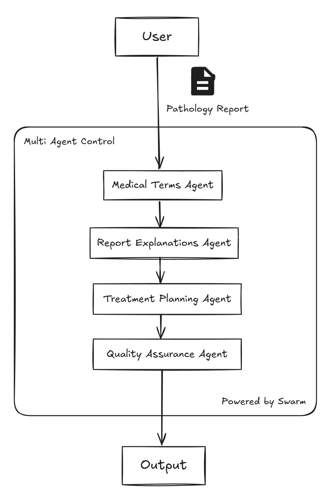

# oncology-swarm: Your personalized oncology specilist

[](https://x.com/dpath_ai) [](https://huggingface.co/DPathAI) [](https://github.com/dpathOfficial)  [](https://medium.com/@pr_72688)  [](https://t.me/+7W_HrtlAsuw0NTFk)  

[](https://opensource.org/licenses/MIT)

## 🌟 Features
- **Developed with WHO Specialists**: Built with insights and expertise from global health leaders to ensure world-class standards. 
- **References WHO and NCCA Guidelines**: Aligns with globally recognized standards for oncology care and best practices.
- **Multi-Agent Architecture**: Specialized agents working together for comprehensive analysis
- **Enterprise-Grade Security**: HIPAA-compliant data handling and processing
- **Quality Assurance**: Built-in QA processes and verification steps
- **Scalable Infrastructure**: Designed for high-volume clinical environments

## 🏗️ Architecture
  

*Visual representation of the multi-agent architecture powering Oncology-Swarm.*


## 🚀 Quick Start
### requirements

```bash
pip install swarms
```

### pathology report interpretation

```python
from oncology_agents import run_report_interpretation_agents

run_report_interpretation_agents(
    report = "insert your report here"
)
```

## 🔧 Configuration

Create a `.env` file in your project root:

```env
OPENAI_API_KEY=your_api_key_here
WORKSPACE_DIR="agent_workspace"
```
## 🔐 Security & Compliance

- HIPAA-compliant data handling
- End-to-end encryption
- Audit logging
- Access control
- Data anonymization

## 🙏 Acknowledgments

- OpenAI for GPT-4 technology
- Anthropic for Claude integration
- Oncology community for standardization guidelines
- Open-source contributors

## ⚠️ Disclaimer

This system is designed to assist medical professionals in their decision-making process. It does not replace professional medical judgment. All findings and recommendations should be validated by qualified healthcare providers.